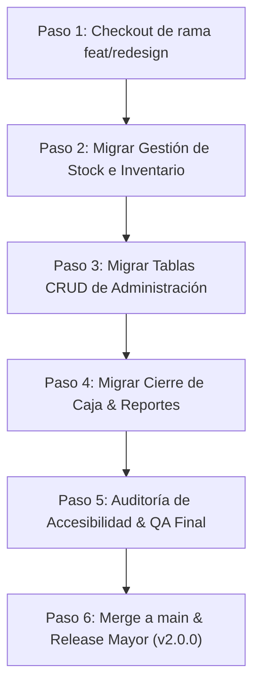

# BazPOS — Sistema de Diseño & Especificación de Rediseño (v2.0 Preview)

> **Estado de la Rama (`feat/redesign`)**:  
> Esta rama contiene la base del rediseño UI/UX integral de BazPOS construido con **Google Stitch** ([stitch.withgoogle.com](https://stitch.withgoogle.com)) y **Tailwind CSS v4**. Queda pausada y documentada para su posterior activación y culminación en la próxima **versión mayor**.

---

## 1. Visión & Objetivos del Rediseño

1. **Modernización Visual & Ergonómica**: Transformar la interfaz de BazPOS en un punto de venta (POS) y panel administrativo de alta gama, con estética dark-mode nativa de alto contraste, acentos violetas/púrpura vibrantes y tipografía distintiva.
2. **Alta Eficiencia para Cajeros & Operadores**: Flujos de trabajo ultra rápidos para el escaneo de código de barras, selección de productos, pagos mixtos y control de inventario sin fricción.
3. **Compatibilidad Híbrida Gradual**: Convivencia transparente entre el motor de utilidades **Tailwind CSS v4** y el sistema previo de variables CSS (`design-system.css`), facilitando la migración progresiva pantalla por pantalla.

---

## 2. Fundamentos del Sistema de Diseño (Design Tokens)

### 2.1. Paleta de Colores (Tokens Stitch / Material 3 Dark)

Configurados en `frontend/src/index.css` bajo la directiva `@theme` de Tailwind CSS v4:

| Token | Valor Hex | Uso Principal |
| :--- | :--- | :--- |
| `--color-bg-base` | `#09090f` | Fondo principal de la aplicación |
| `--color-bg-surface` | `#0e0e1a` | Superficie de tarjetas, sidebar y paneles |
| `--color-bg-elevated` | `#151528` | Tarjetas elevadas, modales y cajas de totales |
| `--color-bg-input` | `#111128` | Entradas de texto, selectores y campos de escáner |
| `--color-border-default` | `#24244a` | Bordes estándar y divisores de tablas |
| `--color-primary` | `#d0bcff` / `#8b5cf6` | Color de marca, botones principales y totales |
| `--color-primary-container` | `#a078ff` | Estados hover y acentos interactivos |
| `--color-on-primary` | `#3c0091` | Texto sobre botones primarios |
| `--color-secondary-container` | `#4f319c` | Fondos de enlaces activos y chips |
| `--color-text-primary` | `#edecf2` | Texto principal de alto contraste |
| `--color-text-secondary` | `#a8a5c0` | Subtítulos, metadatos y descripciones |
| `--color-text-muted` | `#656388` | Placeholders, bordes tenues e información secundaria |
| `--color-success` | `#22c55e` | Estados completados, stock disponible e ingresos |
| `--color-warning` | `#f59e0b` | Alertas de stock, advertencias y productos críticos |
| `--color-danger` | `#ef4444` | Sin stock, anulaciones, faltantes y errores |
| `--color-info` | `#3b82f6` | Transacciones, estados en proceso y avisos |

---

### 2.2. Tipografía

Integrada vía Google Fonts en `frontend/index.html`:

- **Display & Encabezados (`--font-display: 'Syne'`)**: Utilizada en marcas, títulos de módulo y encabezados principales para dar carácter y personalidad única.
- **Cuerpo & Formularios (`--font-body: 'DM Sans'`)**: Tipografía geométrica legible y limpia para navegación, etiquetas, tablas y controles.
- **Cifras & Datos Técnicos (`--font-mono: 'JetBrains Mono'`)**: Utilizada en precios en pesos chilenos (`$1.990`), códigos OEM, SKUs, códigos de barras y comprobantes de venta.

---

### 2.3. Iconografía

- **Iconos Principales**: **Google Material Symbols Outlined** (`<span className="material-symbols-outlined">...</span>`).
- **Iconos Complementarios**: Bootstrap Icons (`bi bi-*`) mantenidos para retrocompatibilidad.

---

### 2.4. Clases Utilitarias Propias

```css
/* Tira con gradiente decorativo en encabezados de tarjetas */
.gradient-strip {
  background: linear-gradient(90deg, #d0bcff 0%, #8b5cf6 100%);
}

/* Tarjeta estadística con borde superior luminoso */
.stat-card {
  position: relative;
}
.stat-card::before {
  content: '';
  position: absolute;
  top: 0;
  left: 0;
  right: 0;
  height: 3px;
  background: linear-gradient(90deg, #d0bcff 0%, #a078ff 100%);
  border-top-left-radius: 0.75rem;
  border-top-right-radius: 0.75rem;
}

/* Encabezados compactos para tablas POS */
.pos-table th {
  text-transform: uppercase;
  font-size: 0.7rem;
  letter-spacing: 0.05em;
}
```

---

## 3. Estado de la Implementación (Qué está listo en esta rama)

### 3.1. Infraestructura de Estilos
- [x] Instalación de `tailwindcss` y `@tailwindcss/vite` (Tailwind v4).
- [x] Configuración de plugins en `frontend/vite.config.js`.
- [x] Importación de fuentes y Material Symbols en `frontend/index.html`.
- [x] Tokenización completa de temas en `frontend/src/index.css`.
- [x] Carpeta `frontend/src/stitch/` para almacenamiento de prototipos y plantillas exportadas.

### 3.2. Navegación Principal (`frontend/src/components/Shell.jsx`)
- [x] **Sidebar Reorganizada**:
  - Navegación agrupada semánticamente por rol: *Operaciones* (Vendedor), *Bodega* (Bodeguero), y *Administración* (Gerente).
  - Indicadores activos con diseño de chip redondeado (`bg-secondary-container/30 border border-primary/30 text-primary`).
  - Colapsable en escritorio (250px ↔ 72px) con selector accesible y menú lateral para móviles.
  - Botón de acceso directo **"Nueva Venta"** y lanzador del modal de novedades con punto rojo de notificación.
- [x] **Topbar Rediseñada**:
  - Encabezado sticky con efecto *glassmorphism* (`backdrop-blur-md`).
  - Título dinámico por vista, campana de novedades, alternador de tema Claro/Oscuro y badge de usuario con rol activo (`Gerente`, `Vendedor`, `Bodeguero`).
  - Diálogo de confirmación para cierre de sesión.

### 3.3. Punto de Venta (`frontend/src/pages/VentaPage.jsx`)
- [x] **Arquitectura POS en 2 Columnas**:
  - **Columna Izquierda (Catálogo & Búsqueda)**:
    - Escáner de código de barras con feedback reactivo de pulso verde/rojo.
    - Buscador rápido con debounce por texto y código OEM con botón de limpieza instantánea.
    - Conmutador de vista en Tarjetas (*Grid*) vs. Tabla densa (*Table*).
    - Tarjetas con chips de stock en tiempo real y accesos rápidos a ajuste de stock y costo para gerentes.
  - **Columna Derecha (Gaveta de Checkout Sticky)**:
    - Lista de items con controles de cantidad stepper (`+`/`-`).
    - Regulador de descuento porcentual interactivo.
    - Desglose financiero completo: Subtotal bruto, Descuento, Neto, IVA chileno (19%) y Total en Pesos con regla de redondeo chileno (`roundTotal`).
    - Acciones directas para **Cobrar** y **Generar Cotización**.
- [x] **Flujo Completo de Pago & Modales**:
  - Modal de pago con selección de documento fiscal (Boleta, Factura, Otros) y medios de pago (Efectivo, Tarjeta, Transferencia, Cheque).
  - Soporte para **Pagos Mixtos** con validación en tiempo real del saldo restante.
  - Vista previa e impresión de comprobante / ticket.
  - Diálogo de deducción de stock por ubicación física (`checkUbicaciones`).

### 3.4. Dashboard Ejecutivo (`frontend/src/pages/DashboardPage.jsx`)
- [x] **Estructura Stitch Integrada**:
  - 4 Stat Cards superiores con desglose de ventas brutas, devoluciones, anulaciones, cantidad de tickets y total de productos.
  - Tabla de rendimiento de ventas por vendedor en tiempo real.
  - Panel lateral de alertas de stock bajo mínimo con acciones inmediatas (*Recordar mañana*, *Ignorar*, *+ Pedir a proveedor*).
  - Popover interactivo con alternativas del mismo OEM que tienen stock en tienda o bodega.
  - Tarjeta de Novedades del Sistema conectada al `ChangelogModal`.

---

## 4. Hoja de Ruta para la Siguiente Versión Mayor (Futura Reactivación)

Cuando se decida retomar este rediseño para lanzar la nueva versión mayor, seguir estos pasos en orden:



### Pantallas Pendientes por Migrar al Estilo Stitch:

1. **Gestión de Stock & Bodega**:
   - `frontend/src/pages/InventarioPage.jsx`
   - `frontend/src/pages/UbicacionPage.jsx`
   - `frontend/src/components/QuickStockModal.jsx` y `AjusteStockModal.jsx`
2. **Gestión de Pedidos**:
   - `frontend/src/pages/PedidosPage.jsx`
   - `frontend/src/pages/PedidosCrearPage.jsx`
   - `frontend/src/pages/PedidosProveedoresPage.jsx`
3. **Catálogo & Administración CRUD**:
   - `frontend/src/components/CrudTable.jsx` (Aplicar estilo `.pos-table` y filtros en píldoras)
   - `frontend/src/pages/ProductosPage.jsx` & `ProductoFormPage.jsx`
   - `frontend/src/pages/ProveedoresPage.jsx` & `ProveedorFormPage.jsx`
   - `frontend/src/pages/FacturasPage.jsx` & `FacturaFormPage.jsx`
   - `frontend/src/pages/UsuariosPage.jsx` & `UsuarioFormPage.jsx`
4. **Analítica & Cierre**:
   - `frontend/src/pages/CierreCajaPage.jsx`
   - `frontend/src/pages/ReportesPage.jsx`
   - `frontend/src/pages/ConfiguracionPage.jsx`
   - `frontend/src/pages/LoginPage.jsx`

---

## 5. Comandos de Verificación & Build

```bash
# Entrar al frontend
cd frontend

# Verificar linting (ESLint)
npm run lint

# Compilar para producción (Vite + Tailwind v4)
npm run build

# Servidor de desarrollo
npm run dev
```

---

*Documento generado y archivado en la rama `feat/redesign`.*
