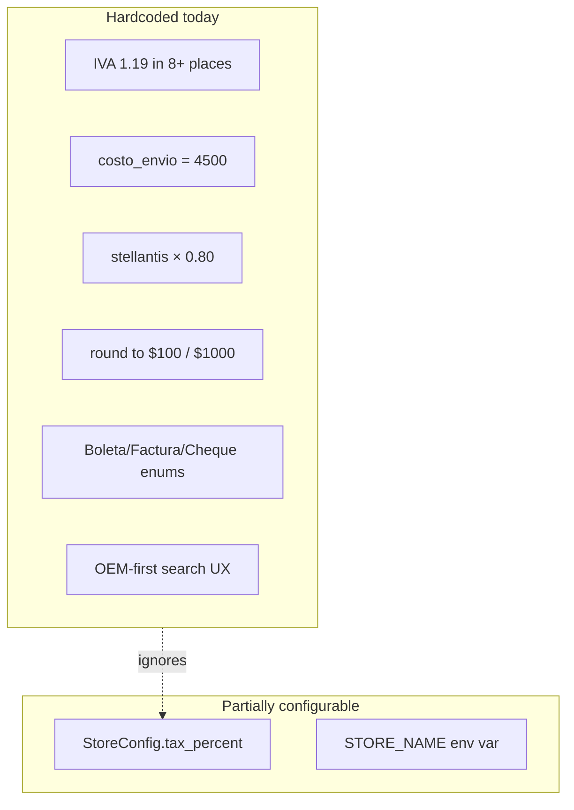
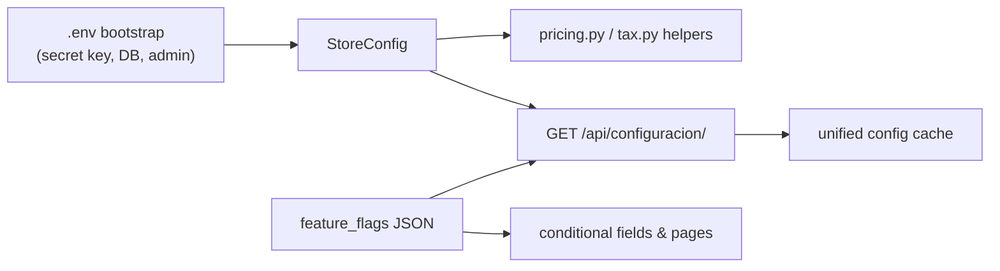

# BazPOS Roadmap — Agnostization

Turn BazPOS from a single-store auto-parts POS into a **productized, single-tenant retail POS**: one Docker install per customer, with business rules driven by an expanded `StoreConfig` and optional feature flags—without multi-tenant complexity.

**Target deployment model:** one store per installation (each customer gets their own Docker stack + MariaDB).

**Target vertical scope:** generic configurable retail POS; auto-parts fields (OEM, marca, código proveedor) remain available but optional via feature flags.

---

## Current state

BazPOS is already **partially** parameterized (`STORE_NAME` env, `StoreConfig` singleton for phone/address/tax/timezone), but most business logic is hardcoded for one Chilean auto-parts store:



**Good news:** the target model (one install = one store) means we do **not** need tenant FKs on every model. The existing `StoreConfig.current()` singleton is the right pattern—just make it the **single source of truth** for all business rules.

---

## Target architecture



Each customer gets their own Docker stack + MariaDB. Configuration lives in `StoreConfig` (editable via UI after first login), not in code.

---

## Phase 1 — Unify configuration (foundation)

**Goal:** one config object, one API fetch, no duplicated tax/rounding logic.

**Status:** done (`feat/phase-1-unified-config`)

### Backend: expand `StoreConfig`

File: [`gerenteApp/models.py`](gerenteApp/models.py)

Add fields (defaults preserve current Chile/auto-parts behavior for existing installs):

| Field | Purpose | Default |
|-------|---------|---------|
| `nombre` | Store display name (replaces `STORE_NAME` env) | from env on first migrate |
| `currency_code` | ISO 4217 (`CLP`, `USD`, …) | `CLP` |
| `locale` | Formatting (`es-CL`, `en-US`) | `es-CL` |
| `price_round_to` | Round sale prices up to nearest N | `100` |
| `total_round_to` | Round sale totals to nearest N | `1000` |
| `total_round_threshold` | Remainder ≥ N bumps to next thousand | `900` |
| `default_shipping_cost` | Default pedido shipping surcharge | `4500` |
| `default_margin_percent` | Quick-create / form default | `30` |
| `feature_flags` | JSON dict (see Phase 3) | `{}` |

Create shared helpers in a new module, e.g. [`gerenteApp/pricing.py`](gerenteApp/pricing.py):

```python
def apply_tax(amount) -> int: ...       # uses StoreConfig.current().tax_percent
def round_price(amount) -> int: ...      # uses price_round_to
def round_sale_total(amount) -> int: ... # uses total_round_to + threshold
```

### Replace all hardcoded `1.19` and rounding

Priority files (today they ignore `StoreConfig`):

- [`vendedorApp/models.py`](vendedorApp/models.py) — `Producto.save()`
- [`vendedorApp/serializers.py`](vendedorApp/serializers.py) — `_calcular_item`, `_round_total`
- [`vendedorApp/api.py`](vendedorApp/api.py) — `_calcular_item_view`, document HTML
- [`frontend/src/lib/tax.js`](frontend/src/lib/tax.js) — remove `cachedTaxPercent = 19` fallback as sole source
- [`frontend/src/pages/VentaPage.jsx`](frontend/src/pages/VentaPage.jsx) — call unified config on mount (today it never fetches tax)
- [`frontend/src/pages/PedidosCrearPage.jsx`](frontend/src/pages/PedidosCrearPage.jsx) — use config for shipping/tax/rounding

### Consolidate frontend config cache

Merge [`frontend/src/lib/storeName.js`](frontend/src/lib/storeName.js), [`frontend/src/lib/store.js`](frontend/src/lib/store.js), and [`frontend/src/lib/tax.js`](frontend/src/lib/tax.js) into one module (e.g. `storeConfig.js`) backed by a single `GET /api/configuracion/` call at app init in [`frontend/src/main.jsx`](frontend/src/main.jsx).

### Deprecate duplicates

- Remove legacy `Tax` model in [`gerenteApp/models.py`](gerenteApp/models.py) (only used in tests; production uses `StoreConfig`)
- Keep `STORE_NAME` env as **migration/bootstrap default** for `StoreConfig.nombre`, then serve name from API only

### UI: expand ConfiguracionPage

File: [`frontend/src/pages/ConfiguracionPage.jsx`](frontend/src/pages/ConfiguracionPage.jsx)

Add sections: **Identidad** (nombre), **Moneda y formato**, **Impuestos y redondeo**, **Pedidos** (default shipping). Expose `ubicacion_por_defecto` (already in API, missing from UI).

---

## Phase 2 — Remove store-specific business rules

**Goal:** no code paths named after one supplier or one pricing trick.

**Status:** done (`feat/phase-2-dynamic-rules`)

### `stellantis` → extension seam (store-specific order-line modifier)

Today: boolean `stellantis` on `PedidoDetalle` applies a fixed 20% cost discount. That rule is a uniqueness of the original store, so instead of a generic `OrderPricingRule` model we added a **minimal extension seam**:

- `gerenteApp/store_extensions/` — registry of `OrderLineCostModifier` classes (auto-discovered modules). Core code only calls `apply_modifiers(costo, keys)`.
- `PedidoDetalle.stellantis` → `cost_modifiers` JSON list of applied keys (data migration moves `stellantis=True → ["stellantis"]`).
- The 20% rule ships as `store_extensions/stellantis.py`, clearly marked Biocar-specific; generic installs delete it and define their own.
- UI checkbox shown only when `feature_flags.order_pricing_rules` is true (migration enables it for existing installs).

### `costo_envio` → config-driven default

- `Pedido.costo_envio` default changed from `4500` to `0`
- On create (pedido + cotización→pedido) it defaults from `StoreConfig.default_shipping_cost`
- Existing rows keep their values (column default change only)

### Document types and payment methods → configurable lists

Today hardcoded as Django `TextChoices` in [`vendedorApp/models.py`](vendedorApp/models.py) and duplicated in [`frontend/src/pages/VentaPage.jsx`](frontend/src/pages/VentaPage.jsx).

Approach for single-tenant (no schema explosion):

1. Add `document_types` and `payment_methods` JSON arrays to `StoreConfig`:
   ```json
   {"code": "BO", "label": "Boleta", "active": true}
   ```
2. Expose via `/api/configuracion/` (raw editable lists + `effective_*` resolved lists)
3. Frontend renders `<option>` lists from config (VentaPage, PedidosCrearPage, CierreCajaPage) + editable in ConfiguracionPage
4. Keep DB `CharField` codes; validate against active config on write (`RegistrarVentaSerializer`, `PagoVentaInputSerializer`, `CrearPedidoSerializer`)
5. **Cierre de caja** is now dynamic: `calcular_cierre`/historial pivot by active methods/docs keyed by code; `CierreCaja` stores a `desglose` JSON snapshot (legacy columns kept for backward compat); detail-view valid claves come from active config

This is the largest refactor in the roadmap; do it after Phase 1 so tax/rounding are stable.

---

## Phase 3 — Optional vertical features (parts fields stay, generic UX wins)

**Goal:** same codebase serves a bakery and an auto-parts shop via flags, not forks.

**Status:** done (`feat/phase-3-feature-flags`)

### `feature_flags` on StoreConfig

Suggested flags (all default `false` for new generic installs; migration sets `true` for existing auto-parts behavior):

| Flag | Effect |
|------|--------|
| `product_oem_fields` | Show OEM, OEM alternativo, código proveedor, marca on product forms and search |
| `oem_primary_search` | Venta page searches by OEM first (vs código/nombre) |
| `order_shipping_toggle` | Per-line "sumar envío" in pedidos |
| `order_pricing_rules` | Show cost-modifier checkboxes (ex-Stellantis) |
| `daily_supplier_orders` | PedidoProveedorDia module + dashboard actions |
| `oem_stock_substitutes` | Dashboard "same OEM, other product has stock" warning |
| `supplier_rut_field` | Show RUT on proveedor form (rename label to "ID tributario" when off) |

### Conditional UI

Wrap parts-specific columns/labels in guards reading `getStoreConfig().feature_flags`:

- [`frontend/src/components/ProductoForm.jsx`](frontend/src/components/ProductoForm.jsx)
- [`frontend/src/pages/VentaPage.jsx`](frontend/src/pages/VentaPage.jsx)
- [`frontend/src/pages/PedidosCrearPage.jsx`](frontend/src/pages/PedidosCrearPage.jsx)
- [`frontend/src/pages/DashboardPage.jsx`](frontend/src/pages/DashboardPage.jsx)
- [`vendedorApp/report_fields.py`](vendedorApp/report_fields.py) — filter available columns by flags

### Product search abstraction

Add `StoreConfig.product_search_fields` (ordered list: `codigo_producto`, `nombre`, `oem`, `codigo_proveedor`, `marca`). Backend catalog/search endpoints and Venta autocomplete respect this list instead of assuming OEM-first.

### Generic supplier ID

Rename `Proveedor.rut` → `tax_id` (migration preserves data; `max_length` increase). Validation becomes optional/pluggable per `feature_flags.supplier_rut_field`.

---

## Phase 4 — Packaging and onboarding (product-ready)

**Goal:** a new customer can deploy without reading one store's SOPs.

**Status:** done (`feat/phase-4-packaging-seeds`)

### First-run setup

Store name and locale are **install-time** (`.env` → `sync_store_config` on container start; read-only in the API). After `create_admin`, the Gerente completes the rest in Configuración: moneda, impuesto, redondeo, timezone, ubicación por defecto, feature flags preset.

### Seed profiles

Replace [`docker/management/commands/seed_data.py`](docker/management/commands/seed_data.py) with profiles:

```bash
python manage.py seed_data --profile generic_retail
python manage.py seed_data --profile auto_parts   # current behavior
```

Generic profile: simple SKU products, no OEM, no Stellantis, shipping 0, flags off.

### Docs

- Update [`README.md`](README.md): drop multi-tenant as near-term goal; emphasize single-tenant productization
- Add `docs/instalacion.md` (install, backup via [`ops/backup/`](ops/backup/), upgrade path)
- Tone down auto-parts language in [`docs/guia-tecnica.md`](docs/guia-tecnica.md) or split into "core POS" + "auto parts extension"

### Version bump

Ship as **2.0.0** — config schema changes and Stellantis deprecation are breaking for API consumers and existing customizations.

---

## Recommended order and effort

| Phase | Effort | Risk | Value |
|-------|--------|------|-------|
| 1 — Unified config | ~1 week | Low | Fixes real bugs (tax mismatch); enables everything else |
| 2 — Remove hardcoded rules | ~1–2 weeks | Medium | Makes second customer deployable |
| 3 — Feature flags | ~1 week | Low | Vertical flexibility without forks |
| 4 — Packaging | ~3–5 days | Low | Sellable product |

**Do Phase 1 first.** It is small, high-impact, and every later phase depends on a single pricing/tax path.

---

## Branching & Release Strategy

We are not using repository forks. Execute this entire migration via Git feature branching off `main`:

```text
main (current stable v1.x.x)
 └── feat/agnostization-v2 (epic branch)
      ├── feat/phase-1-unified-config   --> PR into feat/agnostization-v2
      ├── feat/phase-2-dynamic-rules    --> PR into feat/agnostization-v2
      ├── feat/phase-3-feature-flags     --> PR into feat/agnostization-v2
      └── feat/phase-4-packaging-seeds  --> PR into feat/agnostization-v2
```

Each phase branch merges into the epic branch via PR. **Release path:** the epic merges into `staging` first for testing (CI builds images on staging push; no deploy), and after validation `staging` is merged into `main` as the **2.0.0** release (CI push to `main` deploys to the VPS).

---

## Out of scope (for now)

- **No multi-tenant schema** (no `store_id` on `Producto`, `Venta`, etc.) — wrong model for one-install-per-customer
- **No big-bang UI redesign** before config is stable — `feat/redesign` can follow 2.0
- **No full plugin framework** — a minimal `store_extensions/` registry covers store-specific pricing rules; JSON flags + conditional UI is enough until there are 3+ vertical profiles

---

## Success criteria

A new retailer can:

1. `docker compose up` with their `.env`
2. Complete first-run config (currency, tax, rounding)
3. Choose a vertical profile (generic vs auto-parts)
4. Sell, manage stock, close caja, and run reports **without code changes**

Existing installs (e.g. Biocar) migrate with all current behavior preserved via migration defaults and `feature_flags` set to today's values.

---

## Checklist

- [x] **Phase 1:** Expand `StoreConfig` model + pricing helpers; replace hardcoded `1.19`/rounding across backend and frontend
- [x] **Phase 1:** Unify frontend config into single `storeConfig.js` module; expand `ConfiguracionPage` UI
- [x] **Phase 2:** Replace `stellantis`/`costo_envio` hardcodes with configurable order pricing rules and `default_shipping_cost`
- [x] **Phase 2:** Make document types and payment methods configurable JSON; dynamic cierre-caja columns
- [x] **Phase 3:** Add `feature_flags` + `product_search_fields`; gate OEM/parts UI and report columns
- [x] **Phase 4:** First-run setup, seed profiles (`generic_retail` vs `auto_parts`), docs update, 2.0.0 release
