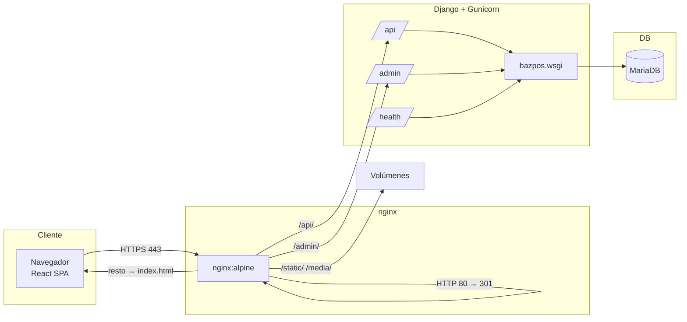
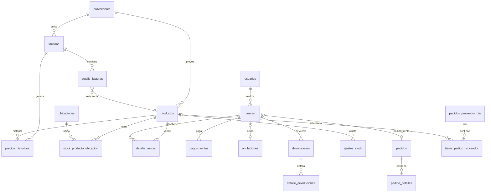
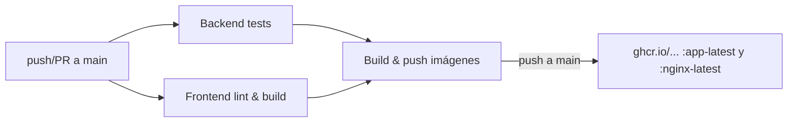
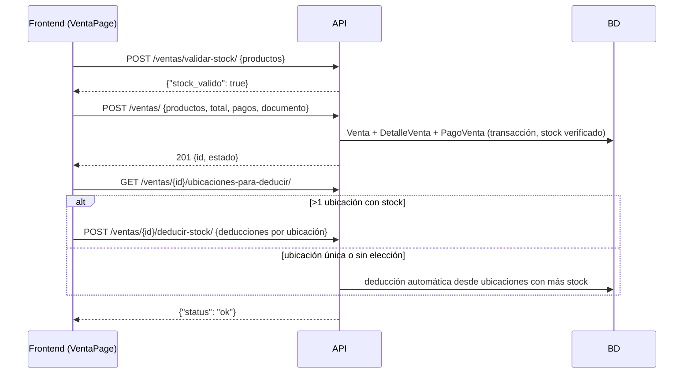

# Guía Técnica — Sistema de Punto de Venta Bazpos

**Audiencia:** Desarrolladores, DevOps y soporte técnico Nivel 2.  
**Cuadrantes Diátaxis:** Referencia técnica (API y modelo de datos) + Explicación (arquitectura e infraestructura).  
**Fuente de verdad:** Este documento se genera a partir del código fuente. Verifique rutas, campos y permisos en `bazpos/api_urls.py`, `vendedorApp/api.py`, `gerenteApp/api.py` y los modelos antes de asumir cambios.

---

## 1. Resumen del sistema

Bazpos es un sistema de punto de venta (POS) para tiendas de repuestos automotrices. Permite vender productos, generar cotizaciones, registrar pedidos a clientes, gestionar inventario por ubicaciones físicas, registrar facturas de compra con recálculo de precios, confeccionar pedidos a proveedores y cerrar caja diariamente.

| Capa | Tecnología | Versión |
| :--- | :--- | :--- |
| Frontend | Vite + React + react-router-dom v7 + TanStack Query v5 | Node 20 / Vite 8 / React 19 |
| Backend | Django + Django REST Framework + SimpleJWT | Django 5.1 / DRF 3.x |
| Base de datos | MariaDB | 12 |
| Servidor | Gunicorn (2 workers, sync) + nginx | — |
| Idioma / formato | `es-cl`, moneda CLP en enteros | — |

---

## 2. Arquitectura

### 2.1 Diagrama de componentes



### 2.2 Flujo de una petición

1. El navegador carga la SPA desde el nginx (`/` → `index.html`, `try_files` con fallback SPA).
2. El usuario inicia sesión en `/api/auth/token/`; el backend entrega un **access JWT** (vida 1 h) y un **refresh JWT** (vida 7 días, rotación con blacklist).
3. Cada petición protegida viaja con `Authorization: Bearer <access>`.
4. Si el access expira, `frontend/src/lib/api.js` detecta el `401`, refresca con `/auth/token/refresh/`, reintenta la petición original; en doble fallo limpia tokens y redirige a `/login`.
5. nginx hace *reverse proxy* de `/api/` y `/admin/` hacia Gunicorn, y sirve `/static/` y `/media/` desde volúmenes compartidos.

### 2.3 Frontend (SPA)

- **Entrypoint único:** `frontend/src/main.jsx` → `frontend/src/router.jsx` (fuente de verdad de rutas).
- **Layout:** `Shell.jsx` (sidebar por rol + topbar con tema claro/oscuro + área de contenido).
- **Estado servidor:** `@tanstack/react-query` (hooks en `frontend/src/lib/queries.js`).
- **Guards de ruta** (`frontend/src/guards.jsx`):
  - `ProtectedRoute`: valida el JWT contra `/auth/me/` en cada visita.
  - `GerenteGuard`: permite **Gerente** y **Encargado**.
  - `BodegueroGuard`: permite **Bodeguero**, **Encargado** y **Gerente**.
- **Helpers:** `lib/api.js` (cliente HTTP + auto-refresh), `lib/auth.js` (tokens/roles), `lib/tax.js` (cálculo de precios con IVA), `lib/store.js` / `lib/storeName.js` (configuración de tienda en runtime), `lib/theme.js`, `lib/changelog.js`.

**Rutas principales** (`router.jsx`):

| Ruta | Página | Acceso |
| :--- | :--- | :--- |
| `/` | Dashboard | Todos |
| `/ventas` | Realizar venta | Todos |
| `/ventas/pedidos` | Nuevo pedido / historial | Todos |
| `/ventas/historial` | Historial ventas/devoluciones/pedidos | Todos |
| `/ventas/inventario` | Inventario | Todos (bodeguero sin duplicado en menú) |
| `/ubicaciones` | Ubicaciones | Bodeguero + (Encargado/Gerente) |
| `/productos` (+`/crear`, `/:id/editar`) | Productos | Gerente/Encargado |
| `/proveedores` (+form) | Proveedores | Gerente/Encargado |
| `/usuarios` (+form) | Usuarios | Gerente/Encargado |
| `/facturas` (+form) | Facturas | Gerente/Encargado |
| `/pedidos-proveedores` | Pedidos a proveedores | Gerente/Encargado |
| `/configuracion` | Configuración tienda | Gerente/Encargado |
| `/reportes` | Reportes | Gerente/Encargado |
| `/cierre-caja` | Cierre de caja | Gerente/Encargado |
| `/login` | Login | Solo sin sesión |

> El menú se filtra por rol en `Shell.jsx`. Las rutas de gerencia están envueltas en `GerenteGuard`; `/ubicaciones` en `BodegueroGuard`.

### 2.4 Backend (Django + DRF)

- **Apps:** `gerenteApp` (Proveedor, Factura, StoreConfig, Usuario) y `vendedorApp` (Producto, Venta, Devolucion, Pedido, Stock, Cierre de caja), más `chatApp` (chat interno) y `docker` (comandos de gestión).
- **Router:** `bazpos/api_urls.py` (DefaultRouter bajo `/api/`).
- **Autenticación:** `rest_framework_simplejwt` (JWT) + Session (admin).
- **Permisos** (`bazpos/permissions.py`):
  - `HasKnownRole`: requiere uno de los 4 roles de negocio.
  - `RoleActionPermission`: mapea acción DRF → roles permitidos vía `role_action_map` por ViewSet.
  - Los superusuarios **bypasean** toda verificación de rol.
- **Paginación** (`vendedorApp/pagination.py`): `PageNumberPagination`, `page_size` por defecto 50, parámetro `page_size` (máx. 200).
- **Motor de BD:** PyMySQL (versión de compatibilidad forzada a `(2, 2, 1)` en `settings.py`; **no cambiar**).
- **Middleware:** `RequestLogMiddleware` (primer middleware) registra todas las peticiones en un ring buffer visible en `/admin/logs/`.

### 2.5 Roles de negocio

Grupos creados por `python manage.py setup_groups` (docker/management/commands/setup_groups.py):

| Grupo | Permisos Django de modelo | Acceso funcional |
| :--- | :--- | :--- |
| **Vendedor** | view_producto, todos sobre venta/detalle_venta/pedido/pedidodetalle, view_storeconfig, add_pedidoproveedordia | Vender, cotizar, pedidos, historial, inventario de consulta, agregar ítems al pedido a proveedor |
| **Encargado** | Todo lo de venta + anulación/devolución, productos, facturas, proveedores, usuarios, storeconfig, ubicaciones, pedidos a proveedores | Gestión completa de tienda (sin incluir solo lectura) |
| **Bodeguero** | view/add/change_producto, venta, pedidos, ajustestock, stockproductoubicacion, ubicaciones, view_storeconfig, add_pedidoproveedordia | Inventario, ajustes de stock, ubicaciones |
| **Gerente** | Todos los permisos de las entidades de negocio | Acceso total |

> En el frontend, `isGerente()` trata a **Encargado** como gerente y `isBodeguero()` también permite **Encargado** y **Gerente**.

---

## 3. Modelo de datos

### 3.1 Diagrama entidad-relación



### 3.2 Diccionario de datos

Convenciones: todos los montos se almacenan como **`IntegerField`** en pesos chilenos sin decimales (los precios de venta se redondean a $100); los IDs usan `AutoField` salvo indicación. `db_table` real entre comillas.

#### `gerenteApp.models`

| Tabla | Campo | Tipo | Restricciones | Descripción |
| :--- | :--- | :--- | :--- | :--- |
| `proveedores` | `proveedor_id` | AutoField | PK | — |
| | `tax_id` | Char(20) | `UNIQUE`, NULL | ID tributario (RUT u otro) del proveedor |
| | `nombre` | Char(100) | NOT NULL | — |
| | `persona_contacto` | Char(100) | NULL | — |
| | `telefono` | Char(20) | NULL | — |
| | `correo` | Char(100) | NULL | — |
| | `direccion` | Text | NULL | — |
| | `fecha_creacion` | DateTime | default=now | — |
| `facturas` | `id` | AutoField | PK | — |
| | `numero_factura` | BigInteger | NOT NULL | Número de factura |
| | `proveedor` | FK → proveedores | FK, CASCADE | — |
| | `fecha` | Date | default=ayer, `db_index` | — |
| | `monto_total` | Integer | default=0 | Total **neto** |
| `detalle_facturas` | `factura` | FK → facturas | FK, CASCADE, `related_name=detalles` | — |
| | `producto` | FK → productos | FK, CASCADE | Índice `(producto, factura)` |
| | `cantidad` | Integer | NOT NULL | — |
| | `costo_compra` | Integer | NOT NULL | Costo neto unitario |
| `precios_historicos` | `producto` | FK → productos | FK, CASCADE | — |
| | `precio_costo_anterior` | Integer | NOT NULL | — |
| | `precio_costo_nuevo` | Integer | NOT NULL | — |
| | `precio_venta_anterior` | Integer | NULL | — |
| | `precio_venta_nuevo` | Integer | NULL | — |
| | `fecha` | DateTime | default=now | — |
| | `factura` | FK → facturas | FK, SET_NULL, NULL | Factura origen del cambio |
| `taxes` | `tax_percent` | Decimal(5,2) | default=19 | Legado; la fuente de IVA actual es `store_config` |
| `store_config` | `telefono` | Char(20) | default="" | — |
| | `direccion` | Text | default="" | — |
| | `tax_percent` | Decimal(5,2) | default=19 | **IVA vigente** |
| | `timezone` | Char(100) | default="America/Santiago" | — |
| | `ubicacion_por_defecto` | FK → ubicaciones | FK, SET_NULL, NULL | Ubicación por defecto al recibir stock |

> `StoreConfig.current()` (gerenteApp/models.py) devuelve o crea el primer registro (`order_by("id").first()`); es un singleton por convención.

#### `vendedorApp.models`

| Tabla | Campo | Tipo | Restricciones | Descripción |
| :--- | :--- | :--- | :--- | :--- |
| `ubicaciones` | `nombre` | Char(100) | `UNIQUE`, NOT NULL | — |
| | `marca` | Char(100) | default="" | — |
| | `descripcion` | Text | default="" | — |
| `productos` | `producto_id` | AutoField | PK | — |
| | `nombre` | Char(100) | NOT NULL, `db_index` | — |
| | `codigo_producto` | Char(50) | `UNIQUE`, NOT NULL | Código interno / de barras |
| | `oem` | Char(50) | `db_index` | Código OEM (fabricante) |
| | `oem_alternativo` | Text | NULL | — |
| | `codigo_proveedor` | Char(50) | default="", `db_index` | Código del proveedor |
| | `marca` | Char(100) | default="", `db_index` | Índice adicional `(marca, nombre)` |
| | `descripcion` | Text | NOT NULL | — |
| | `precio` | Integer | NULL | Precio venta (calculado, redondeado a $100) |
| | `precio_costo` | Integer | NOT NULL | Costo neto |
| | `stock_minimo` | Integer | NOT NULL | Alerta bajo mínimo |
| | `stock_maximo` | Integer | NOT NULL | — |
| | `margen_utilidad` | Decimal(5,2) | NOT NULL | Porcentaje sobre costo |
| | `proveedor` | FK → proveedores | FK, CASCADE | — |
| | `ignorar_stock_permanente` | Boolean | default=False | Oculta alertas de stock |
| | `recordar_stock_desde` | DateTime | NULL | Reactiva alerta a partir de esta fecha |
| `stock_producto_ubicacion` | `producto` | FK → productos | FK, CASCADE | — |
| | `ubicacion` | FK → ubicaciones | FK, SET_NULL, NULL | `NULL` = sin ubicación |
| | `cantidad` | Integer | default=0 | `unique_together (producto, ubicacion)` |
| `ventas` | `usuario` | FK → auth_user | FK, CASCADE | Vendedor |
| | `fecha_venta` | DateTime | default=now, `db_index` | — |
| | `monto_total` | Integer | NOT NULL | Total con IVA |
| | `monto_subtotal` | Integer | default=0 | — |
| | `descuento_porcentaje` | Integer | default=0 | 0–100 |
| | `estado` | Char(2) | `PE/CO/CA`, `db_index` | Pendiente / Completada / Cancelada |
| | `tipo_documento` | Char(2) | `VE/CO/PE`, `db_index` | Venta / Cotización / Pedido |
| | `venta_origen` | FK → ventas | FK, SET_NULL, NULL | Cotización origen (auto-relación) |
| | `cliente_nombre` | Char(200) | NULL | — |
| | `documento_html` | Text | default="" | Comprobante renderizado (cache) |
| | `documento` | Char(2) | `BO/FA/OT`, NULL | Boleta / Factura / Otros |
| | — | — | — | Índice `(estado, fecha_venta)` |
| `detalle_ventas` | `venta` | FK → ventas | FK, CASCADE | — |
| | `producto` | FK → productos | FK, CASCADE | — |
| | `cantidad` | Integer | NOT NULL | — |
| | `precio_unitario` | Integer | NOT NULL | — |
| | `precio_descontado` | Integer | default=0 | Precio con descuento distribuido |
| | `subtotal` | Integer | NOT NULL | — |
| `pagos_ventas` | `venta` | FK → ventas | FK, CASCADE, `related_name=pagos` | — |
| | `metodo_pago` | Char(2) | `EF/TJ/TR/CH` | Efectivo/Tarjeta/Transferencia/Cheque |
| | `monto` | Integer | NOT NULL | — |
| `anulaciones` | `venta` | OneToOne → ventas | OneToOne, CASCADE | — |
| | `usuario` | FK → auth_user | FK, PROTECT | Quién anuló |
| | `motivo` | Text | NOT NULL | Obligatorio |
| | `fecha_anulacion` | DateTime | auto_now_add | — |
| `devoluciones` | `venta` | FK → ventas | FK, CASCADE, `related_name=devoluciones` | — |
| | `usuario` | FK → auth_user | FK, PROTECT | — |
| | `motivo` | Text | NOT NULL | — |
| | `fecha_devolucion` | DateTime | auto_now_add | — |
| | `monto_devuelto` | Integer | default=0 | — |
| `detalle_devoluciones` | `devolucion` | FK → devoluciones | FK, CASCADE, `related_name=detalles` | — |
| | `producto` | FK → productos | FK, PROTECT, NULL | — |
| | `pedido_detalle` | FK → pedido_detalles | FK, SET_NULL, NULL | Si la devolución es de pedido |
| | `nombre` | Char(200) | default="" | Snap del nombre |
| | `precio_unitario` | Integer | default=0 | Monto devuelto por unidad |
| | `cantidad` | PositiveInteger | NOT NULL | — |
| | `reponer_stock` | Boolean | default=True | — |
| `ajustes_stock` | `producto` | FK → productos | FK, CASCADE | — |
| | `ubicacion` | FK → ubicaciones | FK, SET_NULL, NULL | — |
| | `usuario` | FK → auth_user | FK, PROTECT | — |
| | `cantidad_anterior` | Integer | NOT NULL | — |
| | `cantidad_nueva` | Integer | NOT NULL | — |
| | `motivo` | Text | NOT NULL | Obligatorio |
| | `fecha_ajuste` | Date | default=hoy, `db_index` | — |
| `pedidos_proveedor_dia` | `fecha` | Date | `UNIQUE` | — |
| | `usuario` | FK → auth_user | FK, SET_NULL, NULL | — |
| | `finalizado` | Boolean | default=False | — |
| | `created_at` | DateTime | auto_now_add | — |
| `items_pedido_proveedor` | `dia` | FK → pedidos_proveedor_dia | FK, CASCADE, `related_name=items` | — |
| | `producto` | FK → productos | FK, SET_NULL, NULL | `NULL` = producto personalizado |
| | `proveedor` | FK → proveedores | FK, CASCADE | — |
| | `nombre_custom` | Char(200) | default="" | — |
| | `codigo_proveedor_custom` | Char(50) | default="" | — |
| | `pedido` | Boolean | default=False | Marcado para pedir |
| | `fecha_agregado` | DateTime | auto_now_add | — |
| `pedidos` | `usuario` | FK → auth_user | FK, CASCADE | — |
| | `nombre_cliente` / `telefono_cliente` | Char | NOT NULL | — |
| | `monto_subtotal` / `monto_total` | Integer | NOT NULL | — |
| | `costo_envio` | Integer | default=4500 | — |
| | `metodo_pago` | Char(2) | `EF/TJ/TR/CH` | Efectivo / Tarjeta / Transferencia / Cheque |
| | `estado` | Char(2) | `PR/RE/DE/CA`, `db_index` | Pendiente retirar / Retirado / Devuelto / Cancelado |
| | `estado_documento` | Char(2) | `SB/BO/FA/OT` | Sin boletear / Boleteado / Facturado / Otros |
| | `persona_retiro` | Char(200) | default="" | — |
| | `fecha_retiro` | DateTime | NULL | — |
| | `stock_descontado` | Boolean | default=False | El stock se descuenta al marcar retiro |
| | `activo` | Boolean | default=True, `db_index` | — |
| | `venta` | FK → ventas | FK, SET_NULL, NULL, `related_name=pedido` | Venta PE asociada |
| | `es_cotizacion` | Boolean | default=False | — |
| | `pedido_origen` | FK → pedidos | FK, SET_NULL, NULL | Cotización origen |
| | `fecha_creacion` | DateTime | auto_now_add, `db_index` | — |
| | `motivo_cancelacion` | Text | default="" | — |
| `pedido_detalles` | `pedido` | FK → pedidos | FK, CASCADE, `related_name=detalles` | — |
| | `producto` | FK → productos | FK, SET_NULL, NULL | — |
| | `codigo_proveedor` / `oem` | Char | NOT NULL | — |
| | `proveedor` | FK → proveedores | FK, CASCADE | — |
| | `nombre` | Char(200) | NOT NULL | — |
| | `precio_costo` | Integer | NOT NULL | — |
| | `porcentaje_utilidad` | Decimal(5,2) | NOT NULL | — |
| | `precio_final` | Integer | NOT NULL | Con IVA + envío (redondeado a $100) |
| | `sumar_envio` | Boolean | default=True | — |
| | `stellantis` | Boolean | default=False | Costo base al 80% |
| `cierres_caja` | `fecha` | Date | `db_index` | — |
| | `usuario` | FK → auth_user | FK, SET_NULL, NULL | — |
| | `total_vendido`, `total_devoluciones`, `total_anulaciones`, `total_final` | Integer | default=0 | — |
| | `cantidad_ventas` | Integer | default=0 | — |
| | `efectivo`, `tarjeta`, `transferencia`, `cheque`, `pago_sin_clasificar` | Integer | default=0 | Desglose por pago |
| | `boleta`, `factura`, `otros`, `doc_sin_clasificar` | Integer | default=0 | Desglose por documento |
| | `created_at` | DateTime | auto_now_add | — |

> **Stock derivado:** `stock_actual` **no es columna** (se eliminó en la migración 0007). Es la suma de `stock_producto_ubicacion.cantidad` del producto (ver `ProductoQuerySet.with_stock_actual()` y la propiedad `Producto.stock_actual`).

### 3.3 Cálculos de negocio

- **Precio de venta de producto** (`Producto.save()`): `precio = ceil_a_100(precio_costo × (1 + margen/100) × 1.19)`.
- **Ítem de pedido** (`PedidoCrearPage`/`api.py::_calcular_item_view`):
  - Costo base: `precio_costo` (o `× 0.80` si `stellantis`).
  - `base = costo × (1 + %utilidad)`; `con_iva = base × 1.19`.
  - Si `sumar_envio`: `+ costo_envio` (4.500).
  - `precio_final = ceil_a_100(con_iva)`.
- **Descuento en venta:** redondeo del total a los $1.000 más cercanos; el descuento se distribuye proporcionalmente entre líneas (`_distribute_discount` en `serializers.py`), guardando `precio_descontado` por línea.
- **Impuestos:** `monto_total` ya incluye IVA (19% por defecto en `store_config.tax_percent`). El neto se obtiene dividiendo por `(1 + IVA/100)`.
- **Total del día (cierre):** `total_final = total_vendido − devoluciones − anulaciones`.

---

## 4. API REST

Base: `/api/`. Prefijo en producción servido por nginx. Formato JSON. La API es paginada: respuesta `{"count", "next", "previous", "results"}`.

### 4.1 Autenticación

| Método | Endpoint | Descripción |
| :--- | :--- | :--- |
| `POST` | `/api/auth/token/` | Body `{"username", "password"}` → `{"access", "refresh"}` |
| `POST` | `/api/auth/token/refresh/` | Body `{"refresh"}` → `{"access"}` (rota y blacklistea el refresh) |
| `GET` | `/api/auth/me/` | Devuelve el usuario actual (grupos incluidos) |
| `GET` | `/api/store-name/` | **Público (sin auth)** → `{"name": settings.STORE_NAME}` |

**Parámetros de SimpleJWT** (`settings.py`): `ACCESS_TOKEN_LIFETIME=1h`, `REFRESH_TOKEN_LIFETIME=7d`, `ROTATE_REFRESH_TOKENS=True`, `BLACKLIST_AFTER_ROTATION=True`.

### 4.2 Permisos por rol (resumen)

Mapeo de `role_action_map` de cada ViewSet. `V=Vendedor, B=Bodeguero, E=Encargado, G=Gerente`.

| ViewSet | list | retrieve | create | update/partial/destroy | Acciones extra |
| :--- | :--- | :--- | :--- | :--- | :--- |
| `productos` | V,B,E,G | V,B,E,G | E,G | E,G | `por-codigo` V,B,E,G · `ajustar-stock`/`historial-ajustes` B,E,G · `ignorar-stock` E,G · `ultima-factura` V,B,E,G · `historial-precios` E,G |
| `ventas` | V,B,E,G* | V,B,E,G* | V,B,E,G | — (sin update/destroy) | `validar-stock`/`ubicaciones-para-deducir`/`deducir-stock`/`documento` V,B,E,G · `anular`/`devolver` E,G |
| `devoluciones` | V,E,G | V,E,G | — | — | — |
| `pedidos` | V,B,E,G | V,B,E,G | V,B,E,G | — | `cambiar-estado`/`marcar-retiro`/`cancelar`/`convertir-a-pedido` V,B,E,G · `devolver` E,G |
| `proveedores` | E,G | E,G | E,G | E,G | — |
| `facturas` | E,G | E,G | E,G | E,G | `check-exists`/`buscar-producto`/`impuesto`/`crear-producto-rapido` E,G |
| `usuarios` | E,G | E,G | E,G | E,G | `grupos` E,G |
| `ubicaciones` | B,E,G | B,E,G | B,E,G | B,E,G | — |
| `configuracion` | * | * | E,G | E,G | `*` = V,B,E,G |
| `pedidos-proveedor` | E,G | E,G | E,G | — | `hoy` E,G · `agregar-item` V,B,E,G · `toggle-item`/`eliminar-item`/`finalizar`/`transferir` E,G |

> **Filtrado por vendedor:** `ventas` y `devoluciones` restringen la lista al usuario autenticado salvo rol E/G. `ventas` excluye pedidos inactivos (`tipo_documento=PE` con `pedido.activo=False`).

### 4.3 Fichas técnicas de endpoints principales

#### `POST` `/api/ventas/`
**Descripción:** Registra una venta o cotización (define `tipo_documento`).
**Autenticación:** Bearer JWT. **Roles:** Vendedor, Bodeguero, Encargado, Gerente.
**Body:**
```json
{
  "productos": [{"producto_id": 1, "cantidad": 2, "precio": 23900}],
  "total": 47800,
  "descuento_porcentaje": 10,
  "monto_subtotal": 53100,
  "tipo_documento": "VE",
  "documento": "BO",
  "cliente_nombre": "",
  "pagos": [{"metodo_pago": "EF", "monto": 47800}],
  "venta_origen": null
}
```
**Reglas de validación** (`RegistrarVentaSerializer`):
- Si hay descuento, `monto_subtotal` es obligatorio y `total` debe coincidir con el redondeo esperado (`_round_total`, múltiplo de $1.000).
- La suma de `pagos` debe ser exactamente `total`.
- `venta_origen` debe ser una cotización (`tipo_documento=CO`) no convertida.
- Verifica stock disponible por producto (bloqueo `select_for_update`).
- Una venta (`VE`) queda **Completada**; una cotización (`CO`) queda **Pendiente**.
**Respuestas:** `201 Created` (venta serializada con detalles y pagos) · `400` validación (descuento, pagos, stock) · `401/403` autenticación/rol.

#### `POST` `/api/ventas/{id}/anular/`
**Descripción:** Anula una venta completada y repone stock por ubicación.
**Roles:** Encargado, Gerente.
**Body:**
```json
{
  "motivo": "Error de cobro",
  "restauraciones": [{"producto_id": 1, "ubicacion_id": 2, "cantidad": 2}]
}
```
**Reglas:** Rechaza ventas ya anuladas, cotizaciones y ventas con anulación existente. Exige una restauración por cada producto del detalle. Deja `estado=CA` y crea `Anulacion`.
**Respuestas:** `201 Created` · `400` ya anulada / cotización / restauración faltante · `404` ubicación o producto no encontrado.

#### `POST` `/api/ventas/{id}/devolver/`
**Descripción:** Devuelve dinero (total o parcial) de una venta completada.
**Roles:** Encargado, Gerente.
**Body:**
```json
{
  "motivo": "Garantía",
  "productos": [
    {"producto_id": 1, "cantidad": 1, "monto_devuelto": 23900, "reponer_stock": true, "ubicacion_id": 2}
  ]
}
```
**Reglas:** No permite exceder la cantidad disponible (vendida menos ya devuelta) ni superar el valor de la línea. `reponer_stock` exige `ubicacion_id`. Crea `Devolucion` + `DetalleDevolucion` y acumula `monto_devuelto`.
**Respuestas:** `201 Created` · `400`/`404` según validación.

#### `POST` `/api/ventas/{id}/deducir-stock/`
**Descripción:** Descuenta el stock vendido desde ubicaciones específicas (flujo de venta).
**Roles:** Vendedor, Bodeguero, Encargado, Gerente.
**Body:**
```json
{
  "deducciones": [{"producto_id": 1, "ubicacion_id": 2, "cantidad": 2}]
}
```
**Reglas:** Si no se envían deducciones, descuenta desde las ubicaciones con más stock automáticamente. Valida stock por ubicación con `select_for_update`.

#### `GET` `/api/ventas/{id}/documento/`
**Descripción:** Devuelve el comprobante HTML (render para impresión) de una venta/cotización.
**Roles:** Vendedor, Bodeguero, Encargado, Gerente.
**Respuestas:** `200` con `Content-Type: text/html` (cachea en `documento_html`).

#### `POST` `/api/pedidos/`
**Descripción:** Crea un pedido a cliente o una cotización de pedido (`es_cotizacion`).
**Roles:** Vendedor, Bodeguero, Encargado, Gerente.
**Body:**
```json
{
  "nombre_cliente": "Juan Pérez",
  "telefono_cliente": "+56 9 1234 5678",
  "metodo_pago": "EF",
  "es_cotizacion": false,
  "items": [
    {
      "producto_id": 1, "codigo_proveedor": "A-100", "proveedor_id": 1,
      "oem": "12345", "nombre": "Filtro de aceite", "precio_costo": 8000,
      "porcentaje_utilidad": "30", "sumar_envio": true, "stellantis": false
    }
  ]
}
```
**Reglas:** Los precios finales se recalculan en el backend con `_calcular_item_view` (el cliente envía costo y %utilidad, no el total). Al crear un pedido (no cotización), se agrega un ítem al `PedidoProveedorDia` del día (o al siguiente si está finalizado).
**Respuestas:** `201 Created` · `400` validación.

#### `POST` `/api/pedidos/{id}/convertir-a-pedido/`
**Descripción:** Convierte una cotización de pedido (`es_cotizacion=True`) en pedido activo.
**Roles:** Vendedor, Bodeguero, Encargado, Gerente.
**Body:** `{"detalle_ids": [1,2], "nombre_cliente": "...", "telefono_cliente": "...", "metodo_pago": "EF", "estado_documento": "SB"}`
**Reglas:** Crea el pedido derivado, una `Venta` de tipo `PEDIDO` (Completada) vinculada, y agrega los ítems al pedido a proveedor del día.

#### `POST` `/api/pedidos/{id}/marcar-retiro/` y `cambiar-estado/`
**Descripción:** Marca retiro (nombre de quien retira) o cambia `estado`/`estado_documento`. Al pasar a **Retirado** se descuenta el stock del pedido por primera vez (`_descontar_stock_pedido`).
**Body (`marcar-retiro`):** `{"persona_retiro": "Juan Pérez", "estado_documento": "BO"}`  
**Body (`cambiar-estado`):** `{"estado": "RE", "estado_documento": "FA"}`

#### `POST` `/api/facturas/`
**Descripción:** Registra una factura de compra; recalcula precios de venta y aumenta stock en ubicaciones.
**Roles:** Encargado, Gerente.
**Body:**
```json
{
  "numero_factura": 123456,
  "proveedor_id": 1,
  "fecha": "2026-08-19",
  "productos": [
    {"producto_id": 1, "precio": 8000, "cantidad": 10,
     "ubicaciones": [{"ubicacion_id": 2, "cantidad": 10}]}
  ]
}
```
**Reglas:** Si `(numero_factura, proveedor_id)` ya existe, responde `200` con `existing: true` y los datos actuales. Genera `PrecioHistorico` por producto con cambio de costo/precio.
**Respuestas:** `201 Created` (o `200 existing`) · `400` validación.

#### `GET` `/api/productos/?texto=&proveedor=&sin_stock=&page=&page_size=`
**Descripción:** Listado/búsqueda de productos.
**Roles:** Vendedor, Bodeguero, Encargado, Gerente.
**Parámetros:**
| Parámetro | Tipo | Requerido | Descripción |
| :--- | :--- | :--- | :--- |
| `texto` | string | No | Filtra por nombre, OEM, OEM alternativo, código producto o código proveedor (icontains) |
| `proveedor` | int | No | Filtra por `proveedor_id` |
| `sin_stock` | bool | No | `true` incluye productos sin stock; `false`/ausente solo con stock > 0 |
| `page` / `page_size` | int | No | Paginación (máx 200) |
**Respuestas:** Lista paginada con `producto_id`, `precio`, `precio_costo`, `stock_actual`, `ubicaciones_stock`, `ultima_fecha_llegada`, `proveedor_nombre`, etc.

#### `GET` `/api/productos/por-codigo/?codigo=`
**Descripción:** Busca por código de barra exacto.
**Respuestas:** `{"encontrado": false}` o `{"encontrado": true, "producto": {...}}`.

#### `POST` `/api/productos/{id}/ajustar-stock/`
**Descripción:** Ajusta el stock por ubicación.
**Roles:** Bodeguero, Encargado, Gerente.
**Body:**
```json
{
  "motivo": "Conteo de inventario",
  "fecha": "2026-08-19",
  "ajustes": [{"ubicacion_id": 2, "cantidad": 15}]
}
```
**Reglas:** `motivo` obligatorio; sin ubicaciones duplicadas; crea `AjusteStock` con `cantidad_anterior`/`cantidad_nueva`.

#### `GET` `/api/dashboard/stats/`
**Descripción:** Indicadores del día para el Dashboard.
**Roles:** Todos.
**Respuestas:** `es_gerente`, `ventas_dia` (total, total_vendido, devoluciones, anulaciones, cantidad, desglose por vendedor), `stock` (total_productos, sin_stock, bajo_minimo con `oem_productos`, productos_en_pedido).

#### `GET` `/api/reportes/stats/?mes=&anio=`
**Descripción:** Reportes del mes (gráfico diario, top 10 productos, stock crítico, ventas por vendedor).
**Roles:** Todos.

#### `GET` `/api/cierre-caja/?fecha=YYYY-MM-DD` · `POST` `/api/cierre-caja/` · `GET` `/api/cierre-caja/historial/`
**Descripción:** Consulta/guarda el cierre de caja de una fecha y su historial.
**Roles:** Encargado, Gerente (el backend devuelve `403` si no se tiene el rol).
**Reglas del POST:** recalcula las estadísticas del día y crea `CierreCaja` (varias creaciones por fecha son válidas; la UI muestra la última).

#### `GET` `/api/pedidos-proveedor/hoy/` · `GET/POST` `/api/pedidos-proveedor/` · acciones
**Descripción:** Lista diaria de productos a pedir a proveedores.
**Roles:** `hoy`/list/retrieve E,G · `agregar-item` V,B,E,G · `toggle-item`/`eliminar-item`/`finalizar`/`transferir` E,G.
**Body (`agregar-item`):** `{"producto_id": 1}` (producto existente) o `{"proveedor_id": 1, "nombre_custom": "...", "codigo_proveedor_custom": "..."}`.
**Reglas de `finalizar`:** transfiere los ítems no marcados (`pedido=False`) al día siguiente y marca `finalizado=True`.

#### `POST` `/api/pedidos-proveedor/{id}/toggle-item/{item_id}/` · `DELETE /api/pedidos-proveedor/{id}/eliminar-item/{item_id}/`
**Descripción:** Marca/desmarca un ítem como pedido y elimina ítems de la lista. Rechaza operaciones si el día está `finalizado`.

#### `GET` `/api/chat/state/` · `POST` `/api/chat/messages/`
**Descripción:** Chat interno: estado (últimos 100 mensajes + usuarios activos en ventana de 45 s) y envío de mensajes (`content` ≤ 1.000 caracteres).
**Roles:** Todos.

### 4.4 Códigos de error HTTP

| Código | Significado | Casos típicos |
| :--- | :--- | :--- |
| `200 OK` | Éxito en GET / actualización | Detalles, acciones POST idempotentes (`ok: true`) |
| `201 Created` | Recurso creado | Ventas, pedidos, facturas, devoluciones, anulaciones, cierre de caja |
| `400 Bad Request` | Validación fallida | Descuento/pagos incoherentes, stock insuficiente, motivo faltante, fecha inválida |
| `401 Unauthorized` | Token ausente/expirado | Requiere `Authorization: Bearer` |
| `403 Forbidden` | Rol no permitido | Acción restringida a E/G (anular, devolver, cierre de caja, CRUD de gerencia) |
| `404 Not Found` | Recurso inexistente | Producto/ubicación/proveedor no encontrado |
| `500 Internal Server Error` | Error del servidor | Excepciones no controladas (la app normalmente valida antes) |

---

## 5. Infraestructura y despliegue

### 5.1 Docker Compose (`compose.yaml`)

| Servicio | Imagen | Puertos | Volúmenes | Notas |
| :--- | :--- | :--- | :--- | :--- |
| `db` | `mariadb:12` | — | `mysql_data`, `./docker/mariadb/zz-bazpos-tuning.cnf` (ro) | `mem_limit: 448m`; healthcheck `mariadb-admin ping`; env desde `.env` |
| `app` | build `Dockerfile` (python:3.12-slim) | — | `static_files`, `media_files` | `mem_limit: 320m`; healthcheck `GET /health/`; depende de `db` sano |
| `nginx` | build `Dockerfile.nginx` (node:20 → nginx:alpine) | `80`, `443` | `static_files`, `media_files`, `./certs` | `mem_limit: 64m`; argumento build `VITE_STORE_NAME`; depende de `app` sano |

**Entrypoint** (`docker-entrypoint.sh`, secuencia): esperar BD (30 intentos × 2 s) → `migrate --noinput` → `setup_groups` → `create_admin` → `collectstatic --no-input --clear` → `exec gunicorn` (2 workers sync, timeout 30, `--max-requests 500` ± 50, `bazpos.wsgi`, puerto 8000).

> `collectstatic` usa `--clear`: el directorio `staticfiles` se limpia antes de recolectar (es volumen de Docker en producción).

### 5.2 Nginx (`nginx.conf`)

- Redirección `HTTP 80 → HTTPS 301` (el entorno local sin certificados **fallará**; usar certs o editar nginx.conf).
- TLS 1.2/1.3, certificados en `/etc/nginx/certs/origin.{pem,key}`.
- Headers de seguridad: HSTS (`max-age=63072000`, 2 años), X-Content-Type-Options, X-Frame-Options DENY, X-XSS-Protection.
- Rutas: `/api/` y `/admin/` → proxy a `app:8000`; `/static/` (cache 30 d, immutable) y `/media/` (7 d) desde volúmenes; todo lo demás → SPA `index.html`.

### 5.3 CI/CD (`.github/workflows/test.yml`)

Flujo en `push`/`PR` a `main`, 3 jobs encadenados:



| Job | Comandos | Servicio |
| :--- | :--- | :--- |
| `backend-test` | `pip install -r requirements.txt` → `python manage.py test` | MariaDB 12 (root, `ci-secret`) |
| `frontend-build` | `npm ci` → `npm run lint` → `npm run build` | — |
| `docker-build-push` | `buildx` + login GHCR; push solo en push a main | — |

### 5.4 Variables de entorno (`.env`)

| Variable | Uso | Default en ejemplo | Obligatoria en prod |
| :--- | :--- | :--- | :--- |
| `DJANGO_SECRET_KEY` | Clave secreta Django | `change-me-...` | Sí |
| `DJANGO_DEBUG` | DEBUG (`True`/`False`) | `False` | `False` |
| `DJANGO_ALLOWED_HOSTS` | Hosts permitidos (CSV) | `localhost,127.0.0.1` | Sí (dominio real) |
| `CORS_ALLOWED_ORIGINS` | Orígenes CORS (CSV) | vacío | Opcional (SPA misma origen) |
| `CSRF_TRUSTED_ORIGINS` | Orígenes CSRF confiables | vacío | Opcional |
| `DB_NAME` / `DB_USER` / `DB_PASSWORD` / `DB_HOST` / `DB_PORT` | Conexión MariaDB | `bazpos_db` / `bazpos` / ... / `db` / `3306` | Sí |
| `ADMIN_USER` / `ADMIN_EMAIL` / `ADMIN_PASS` | Superusuario inicial (`create_admin`) | `admin` / ... / ... | Sí |
| `MYSQL_ROOT_PASSWORD` / `MYSQL_DATABASE` / `MYSQL_USER` / `MYSQL_PASSWORD` | Bootstrap del contenedor MariaDB | ... | Sí |
| `STORE_NAME` | Nombre de tienda en runtime (sirve `/api/store-name/`) | `BAZPOS` | Recomendado |
| `VITE_STORE_NAME` | Nombre build-time (fallback frontend) | `BAZPOS` | Opcional |

> Para cambiar el nombre de la tienda en producción: editar `.env` (`STORE_NAME`) y `docker compose up -d` (sin rebuild de nginx).

### 5.5 Salud y monitoreo

- `GET /health/` (sin auth) — usado por el healthcheck del contenedor `app`.
- `/admin/logs/` (superusuarios) — ring buffer de `RequestLogMiddleware` con las últimas peticiones.
- Logs de Gunicorn por `--access-logfile -` (stdout del contenedor, visible en `docker compose logs app`).

### 5.6 Tuning de recursos (VPS 1 vCPU / 1 GiB)

El stack está dimensionado para un VPS pequeño de **1 vCPU / 1 GiB de RAM**. Los límites de memoria **no reservan** la cantidad, solo acotan el máximo; la suma deja margen para el host (~200 MiB), para no arriesgar un OOM kill.

| Contenedor | `mem_limit` | Justificación |
| :--- | :--- | :--- |
| `db` | `448m` | MariaDB: buffer pool 128M + InnoDB + conexiones dentro del tope |
| `app` | `320m` | 2 workers Gunicorn (~70-100 MiB c/u) + maestro + Django |
| `nginx` | `64m` | SPA + proxy estáticos; 1 worker es suficiente |

**MariaDB** — `docker/mariadb/zz-bazpos-tuning.cnf` (montado ro sobre `50-server.cnf` del contenedor, se aplica al reiniciar):

```ini
[mysqld]
innodb_buffer_pool_size = 128M
max_connections = 30
tmp_table_size = 16M
max_heap_table_size = 16M
thread_cache_size = 4
table_open_cache = 400
```

**Aplicar los cambios:** el archivo debe existir en el host junto a `compose*.yaml` (en staging/prod lo sincroniza `ops/staging/scripts/deploy-stack.sh`, ruta `./docker/mariadb/`); si el bind mount apunta a un archivo inexistente, Docker crea un directorio vacío y la config **no** se aplica. Luego recrear contenedores:

```bash
docker compose up -d            # recrea db (montaje nuevo) y aplica mem_limit + config
docker compose up -d --build    # rebuild de la imagen app para los 2 workers de gunicorn
```

Reglas:
- `innodb_buffer_pool_size` es la **palanca #1**: ~30% del tope del contenedor. Subirlo exige subir `mem_limit` (o el VPS).
- **No** tocar `innodb_log_file_size` sin confirmar la versión exacta de `mariadb:12`: el redolog se redimensiona con cuidado y la carga actual no lo justifica.
- `max_connections = 30` es amplio para 2 workers Django (la app no usa `CONN_MAX_AGE`).
- Verificar al aplicar: `SHOW VARIABLES LIKE 'innodb_buffer_pool_size'` y `SHOW GLOBAL STATUS LIKE 'Innodb_buffer_pool_read%'` (hit ratio `1 - reads/read_requests` como **tendencia**, no como gate de 99%).

**Gunicorn** — 2 workers *sync* (no ASGI): en 1 vCPU más workers no dan paralelismo real de CPU y duplican memoria. `--max-requests 500 ± 50` reinicia workers para evitar fuga de memoria dentro del tope de 320m. El número de workers se decide por duración/volumen de requests y mediciones, **no** por cantidad de cajeros.

**Escalado futuro (~10 cajeros):** VPS de **2 GiB / 2 vCPU** como mínimo razonable (4 GiB con reportes o crecimiento de datos). MariaDB + WSGI siguen siendo la elección correcta; subir workers solo tras una prueba de carga.

**Auditoría de queries (N+1):** `python manage.py profile_endpoints` (comando en `docker/management/commands/`) cuenta y mide las queries de serialización de los endpoints pesados (ventas, devoluciones, productos, pedidos-proveedor). Usa `CaptureQueriesContext`, así que funciona con `DEBUG=False`. Los querysets de listado ya usan `select_related`/`prefetch_related`; el riesgo latente son los `SerializerMethodField` de los serializers, que pueden disparar una query por fila.

---

## 6. Flujos de negocio clave

### 6.1 Venta → deducción de stock



El comprobante HTML se genera en `GET /ventas/{id}/documento/` y se cachea en `venta.documento_html`.

### 6.2 Factura de compra → precios y stock

1. `POST /facturas/` valida duplicados (`numero_factura` + `proveedor`).
2. Por cada línea crea/actualiza `DetalleFactura` y suma stock en las `StockProductoUbicacion` indicadas.
3. Registra `PrecioHistorico` (costo y precio de venta anterior → nuevo).
4. `Producto.save()` recalcula `precio` a partir del nuevo `precio_costo` y `margen_utilidad`.

### 6.3 Pedido a proveedor (lista diaria)

```mermaid
flowchart TD
    A[Stock crítico en Dashboard<br/>'Agregar a pedido'] --> C[ItemPedidoProveedor del día]
    B[Pedido a cliente / venta<br/>auto-agrega ítem] --> C
    D['+ Agregar producto' manual<br/>existente o custom] --> C
    C --> E[Gerente marca casillas 'Pedido']
    E --> F[Imprimir listado]
    F --> G['Terminar pedido' / finalizar]
    G -->|pendientes (pedido=False)| H[Día siguiente]
    G -->|finalizado=True| I[Inmutable]
```

### 6.4 Pedido a cliente (encargo)

1. Se crea con `es_cotizacion=false`; se recalculan precios con IVA + envío en el backend.
2. Al marcar **retiro** (`marcar-retiro` o `cambiar-estado` → `RE`), el stock se descuenta la primera vez (`stock_descontado` guarda el estado).
3. La venta asociada (tipo `PEDIDO`) se crea en `convertir-a-pedido` (cuando la cotización se convierte). Las devoluciones de pedido descuentan `monto_devuelto` y reponen stock por ubicación.

---

## 7. Desarrollo y operación

### 7.1 Entorno local

```bash
# Backend (requiere .env + MariaDB local)
python manage.py runserver            # local
python manage.py runserver 0.0.0.0:8000   # accesible en LAN

# Frontend
cd frontend && npm run dev            # local (Vite)
cd frontend && npm run dev -- --host 0.0.0.0   # LAN

# Verificación frontend
cd frontend && npm run lint && npm run build
```

### 7.2 Base de datos local

```bash
DB_NAME=bazpos_db DB_USER=<user> DB_PASSWORD=<pass> python manage.py migrate
python manage.py setup_groups
python manage.py create_admin        # requiere ADMIN_USER/EMAIL/PASS
python manage.py seed_data           # datos demo (opcional)
python manage.py seed_ventas_diarias # serie de ventas para reportes (opcional)
python manage.py profile_endpoints   # auditoría de queries (N+1) de endpoints pesados
```

> La BD de tests es `test_bazpos_db`; el usuario local necesita permisos `ALL ON test_bazpos_db.*`. En CI se usa el servicio MariaDB con root.

### 7.3 Tests

```bash
python manage.py test --noinput
```

- Los tests crean grupos con `call_command("setup_groups")`; fixtures compartidos en `docker/test_utils.py` (`create_business_groups`, `make_user`, `auth_client`).
- No hay pytest configurado: se usa el runner de Django (`manage.py test`).

### 7.4 Producción

```bash
cp .env.production.example .env   # editar secretos
docker compose up -d --build      # build inicial o rebuild tras cambios
```

> nginx exige certificados en `./certs/origin.{pem,key}` (HTTP→HTTPS). Para pruebas locales sin certs, ajustar `nginx.conf` temporalmente.

### 7.5 Lanzamiento (release)

El changelog se empaqueta en el frontend en build (`import.meta.env.CHANGELOG` en `vite.config.js`) y se muestra en el modal "Novedades".

```bash
cd frontend
npm version X.Y.Z        # o patch|minor|major (crea tag vX.Y.Z)
npm run release          # redacta CHANGELOG.md para la versión actual (no la cambia)
git add ../CHANGELOG.md
git commit -m "changelog X.Y.Z"
```

`npm run changelog` regenera la entrada sin cambiar versión. La redacción la hace un LLM (opcional; fallback a lista de subjects) configurable vía `BAZPOS_LLM_API_KEY`, `BAZPOS_LLM_BASE_URL` y `BAZPOS_LLM_MODEL` (OpenRouter).

---

## 8. Decisiones de arquitectura (explicación breve)

| Decisión | Justificación |
| :--- | :--- |
| **SPA + API DRF (misma origen)** | nginx sirve el bundle y hace proxy a `/api/`; elimina CORS en producción y simplifica el despliegue. |
| **JWT con rotación + blacklist** | Permite logout real del refresh token y limita la ventana del access a 1 h. |
| **Montos en enteros CLP** | Evita errores de punto flotante en dinero; redondeos explícitos a $100 en precios de venta y descuentos. |
| **Stock derivado por suma** | El stock real es la suma de `stock_producto_ubicacion`; permite rastrear stock por ubicación y enmendar con ajustes auditables (`AjusteStock` con motivo). |
| **Precio de venta calculado en `save()`** | Centraliza la fórmula costo×margen×IVA y el histórico de precios queda auditado por factura (`PrecioHistorico`). |
| **Comprobante HTML cacheado** | `documento_html` evita regenerar el documento; la impresión es estable incluso si cambia la configuración. |
| **Blue-Green sin downtime** | Las imágenes se versionan por SHA en GHCR (`app-<sha>` / `nginx-<sha>`) y se referencian por alias; el upstream de nginx puede apuntarse al nuevo contenedor sin cortes. |
| **PyMySQL 2.2.1 forzado** | Compatibilidad de versión necesaria para MariaDB; no reemplazar por mysqlclient. |
| **MariaDB sobre SQLite** | SQLite fue evaluada (driver puro ORM, sin SQL crudo, simplifica backup/dev), pero se descartó: `select_for_update` es no-op en SQLite y los 4 workers competirían en read-modify-write de stock. MariaDB escala a múltiples cajeros y la penalización se mitiga con límites de memoria + 2 workers. |